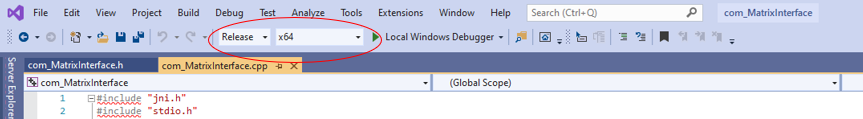
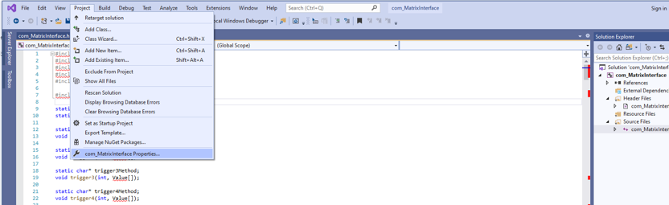
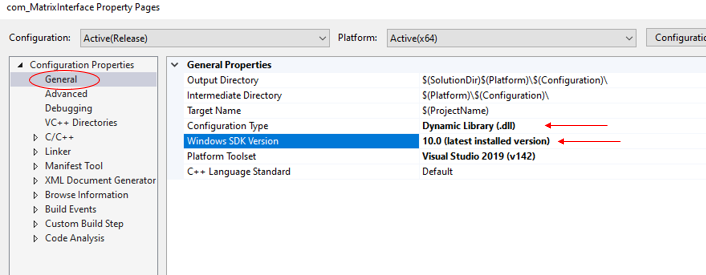
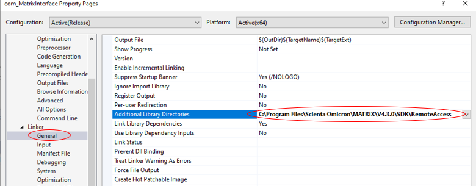
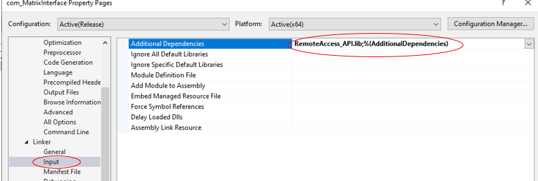
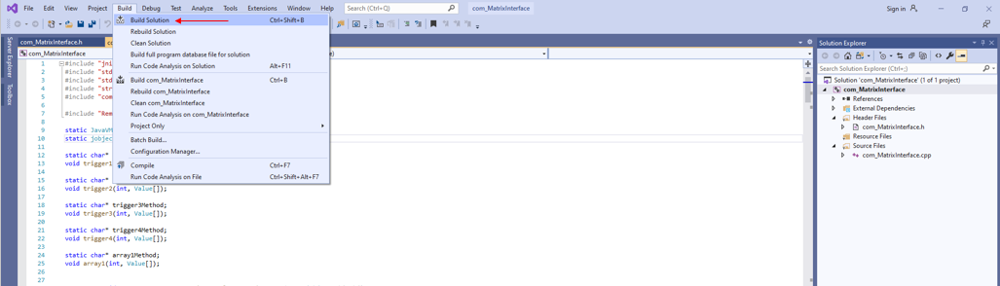

# Installation of ABDController_C_Code

The **ABDController_C_Code** is the C code that directly interfaces with the Matrix *RemoteAccess_API*.  This C code communicates with the **ABDContoller** java code via the Java Native Interface (jni).  

This document details:
1. Setup of the Visual Studio Community IDE[¹] to allow modification of *com_MatrixInteface.dll* (the dynamic link library that calls functions in the *Matrix RemoteAccess_API*)
1. The use of jni to generate *com_MatrixInterface.h* (the C header file that defines communication between Java and C).

## 1. Set up the IDE
First, if needed, install Visual Studio Community (a free IDE that enables generation of a Windows10 compliant dll), which can be found at: 
https://visualstudio.microsoft.com/vs/community/

When choosing what components to install, make sure to enable "Desktop development with C++" - this should provide everything necessary to work with the "solution" file: [ABDController_C_Code/vc/com_MatrixInterface/com_MatrixInterface.sln](vc/com_MatrixInterface/com_MatrixInterface.sln).

Next open [ABDController_C_Code/vc/com_MatrixInterface/com_MatrixInterface.sln](vc/com_MatrixInterface/com_MatrixInterface.sln) in the Visual Studio IDE.

### 1a. Ensure that the Solution configuration is "Release" and the Solution platform is "x64":


### 1b. Open the project properties window:


### 1c. Under Configuration Properties > General, ensure that the Configuration Type is "dll" and that the Windows SDK Version is "10.0 (latest installed version)":


### 1d. Under C/C++ > General, ensure that "Additional Include Directories" is pointing to the include and include\win32 folders of your installed JDK 8, and to the RemoteAccess directory of the Matrix SDK:


### 1e. Under Linker > General, ensure that "Additional Library Directories" is pointing to the  RemoteAccess directory of the Matrix SDK:


### 1f. Under Linker > Input, ensure that "Additional Dependencies" is pointing to the  RemoteAccess library file: *RemoteAccess_lib*:


### 1g. The IDE should now be properly setup.
This can be verified by "building" the solution:


This should generate the dll file: **ABDController_C_Code\vc\com_MatrixInterface\x64\Release\com_MatrixInterface.dll** which can then be copied into the [ABDController](../ABDController) folder.

## 2. Re-generate com_MatrixInterface.h:
If changes have been made to the java code for ABDController/com/MatrixInterface.java, then com_MatrixInterface.h needs to be regenerated and placed in appropriate folders.  This can be done by re-running the install.bat file:

Using the windows command line (cmd), navigate to the [ABDController](../ABDController) folder, and execute [install.bat](install.bat):

```cmd
C:\Users\foo\git\ABDNavigator-master>cd ABDController
C:\Users\foo\git\ABDNavigator-master\ABDController>install.bat
```


#### ¹ Disclaimer
[¹]:#-disclaimer
Certain commercial equipment, instruments, or materials are identified in the documents of this project to foster understanding. Such identification does not imply recommendation or endorsement by the national institute of standards and technology, nor does it imply that the materials or equipment identified are necessarily the best available for the purpose.
