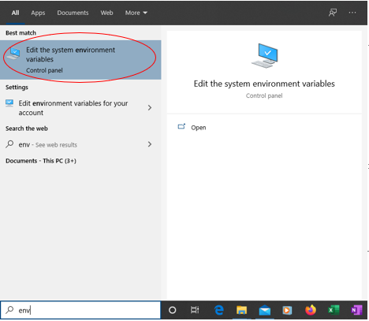
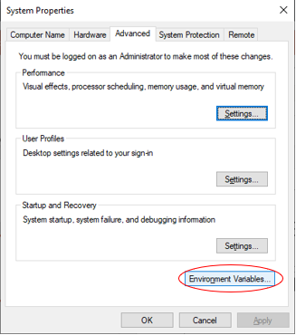
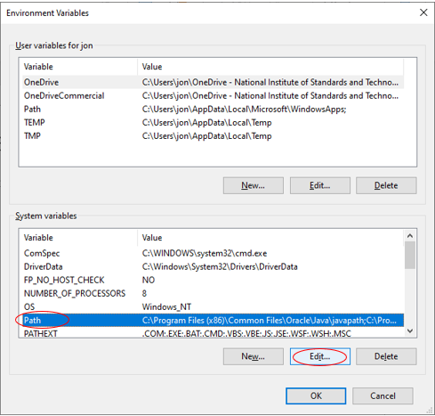
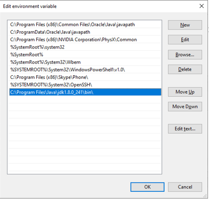
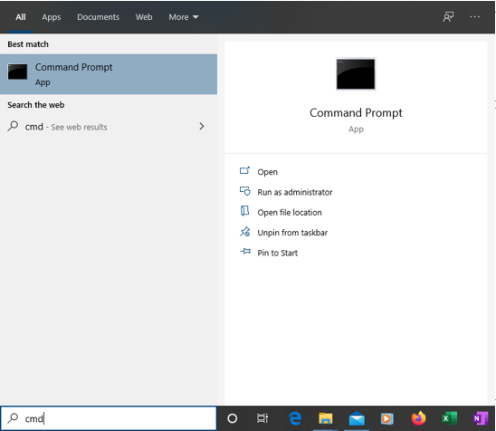

# Installation of ABDNavigator

Installation of ABDNavigator consists of compiling the source files into .class files, and copying one .css file into the appropriate location.  This is done most straightforwardly from the command line (cmd).

## 1. Install JDK 8 (if not already installed) 
The simplest way to compile is to first have JDK 8 installed (newer jdk versions require a separate download of JavaFX).  JDK 8 can be found here: https://www.oracle.com/java/technologies/javase-jdk8-downloads.html.  If not already installed, download and install the 64-bit windows version.

## 2. Set appropriate Windows path for JDK 8 (if not already set)
Ensure that the windows environment "path" variable is set appropriately (by default it probably will not be).  First, find the dialog to set environment variables through the windows search bar:

Click the *Environment Variables...* button:

Select *Path* and click the *Edit...* button:

If the path to JDK 8 doesn't exist already, create a new entry pointing to the **bin** folder of JDK 8, which should look something like what follows (you can verify the proper location by navigating to it in windows explorer):

## 3. Compile the source code into .class files.
Open the windows command line:

install.bat

