# Quick Start Tutorial

## Startup
Before starting, ensure that a directory has been setup where the data will be stored which contains a navigation file.  A default navigation file can be copied from the ABDNavigator folder: [default_deviceNavigation.xml](default_deviceNavigation.xml).

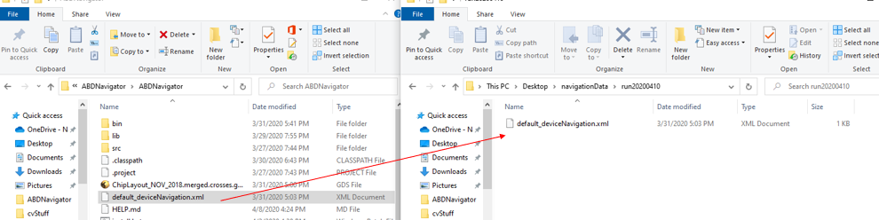

When you first start ABDNavigator (using [run.bat](run.bat)) from the command line, a "file open" dialog is displayed. Find the data directory you setup and choose the navigation xml (e.g. *default_deviceNavigation.xml*) file. 

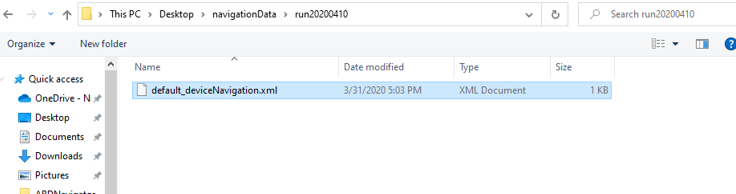

## Some First Steps
There is currently no menu system implemented, so all functionality is achieved through **hot-keys** (detailed in the next section) and operations exposed by the **Attribute Editor**.  As an introduction, here are some first steps to try:

## 1. Toggle the **Tree View** 
Press: **Ctrl** + **T**

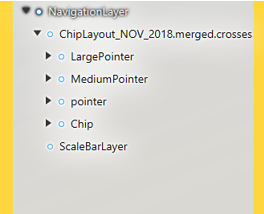

## 2. Toggle the **Attribute Editor**
Press: **Ctrl** + **A**

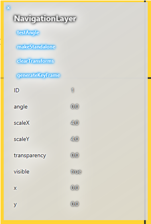

## 3. Create a **PathLayer**
Select *NavigationLayer* in the **Tree View**.  Then Press: **Ctrl** + **=**

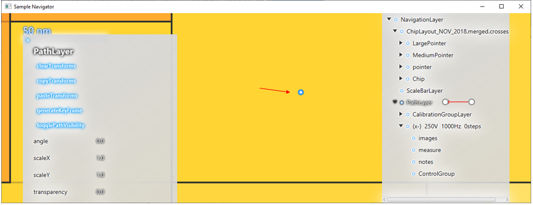

## 4. Create a course step
Select the *PathLayer* or one of the existing coars steps within it.  Then press: **=**

Now move the mouse to the new location to be coarse walked to, and click.

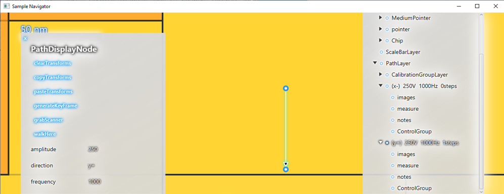

## 5. Add an image to the *NavigationLayer*
Select *NavigationLayer* in the **Tree View**.  Then press: **Ctrl** + **o**

In the **File Open** dialog, ensure that "Image File" is selected in the file type dropdown.

Then choose the desired image file.  This will add an image as a "child" of the *Navigation Layer*.

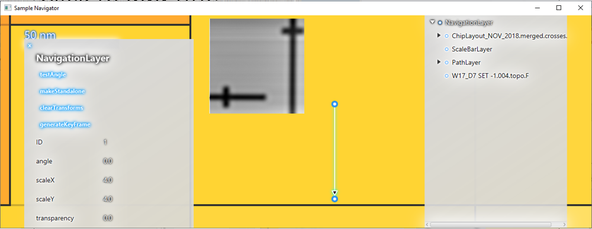

## 6. Zoom in and out, and move the map
Use the **middle mouse-wheel** to zoom in and out.  **Left-click** and **drag** to move around on the **map**.  Click on map objects to select them (or alternatively click on them in the **Tree View**).

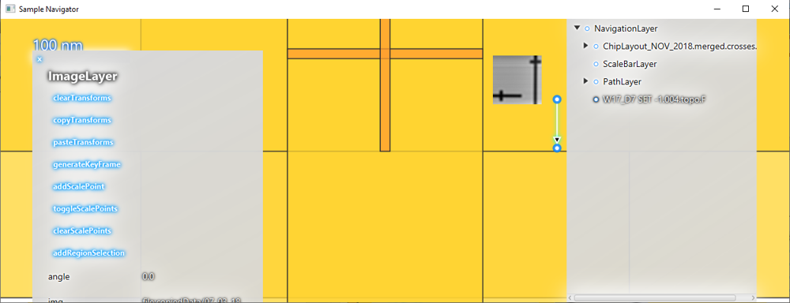

## 7. Move the selected object
Select the image that was added in step 5.  While holding down **Alt**, **left-click** and **drag**.  

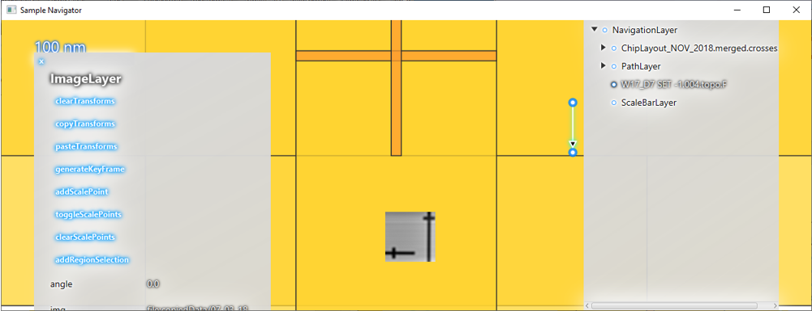

## 8. Hide selected objects
Select an object on the map or in the **Tree View**.  Press: **Space**.  

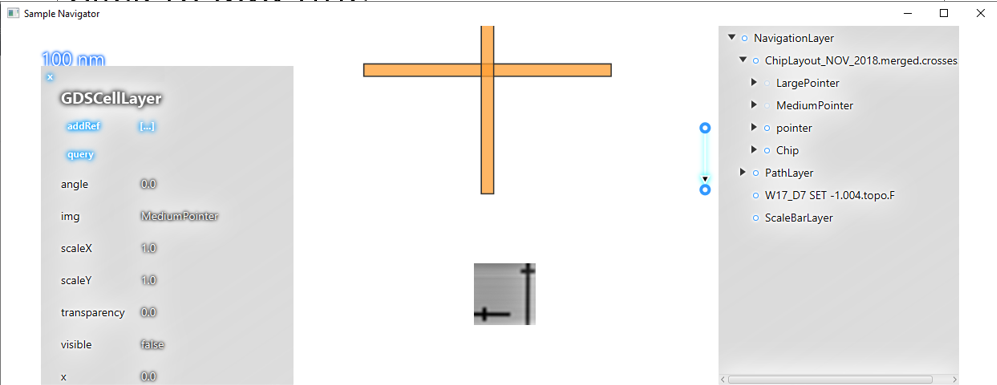

The selected object will be hidden, and its listing in the **Tree View** will be grayed out.

## 9. Add an image to something other than the *NavigationLayer*
Select one of the *image* groups from the **Tree View**.  Then open an image as before (using **Ctrl** + **o**).

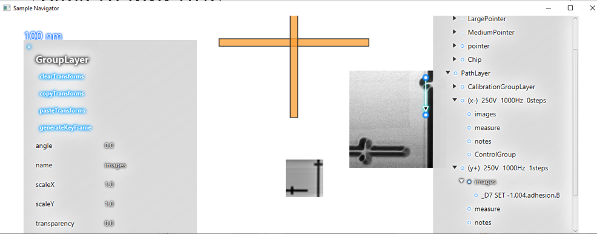

## 10. Adjust the position of one of the coarse walk nodes
This is useful if the coarse walk calibration is a little off.  Select the node in the tree view and perform a move operation as described above (while holding **Alt**, **left-click** and **drag**).

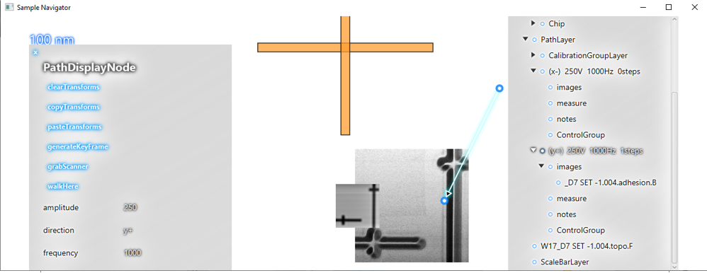

## 11. Move the *PathLayer* in front of the image that was added to the *NavigationLayer* before
Select *PathLayer* in the **Tree View**.  Then press: **Ctrl** + **F**.

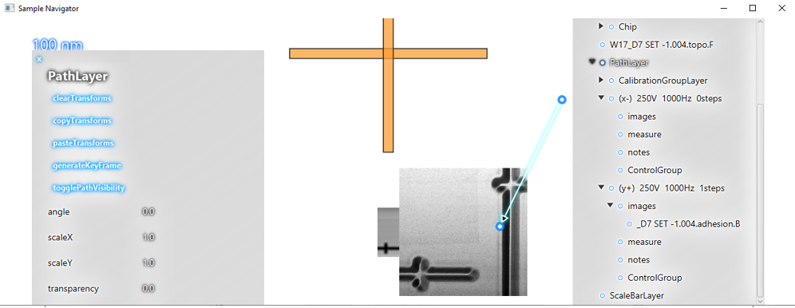

(**Ctrl** + **B** will move it backwards)

## 12. Rotate the map
**Right-click** and **drag**

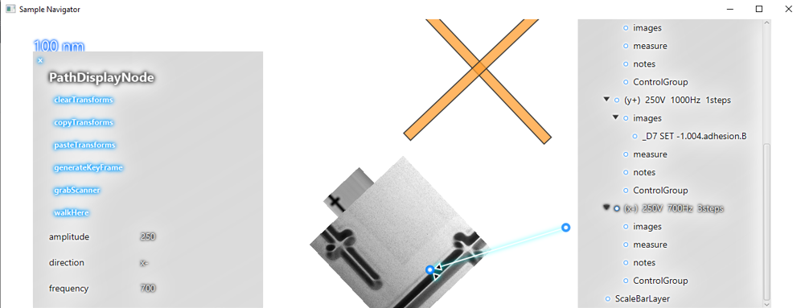

## 13. Add a *Group* object to the *NavigationLayer*
Select *NavigationLayer* in the **Tree View**.  Then press: **Ctrl** + **g**.

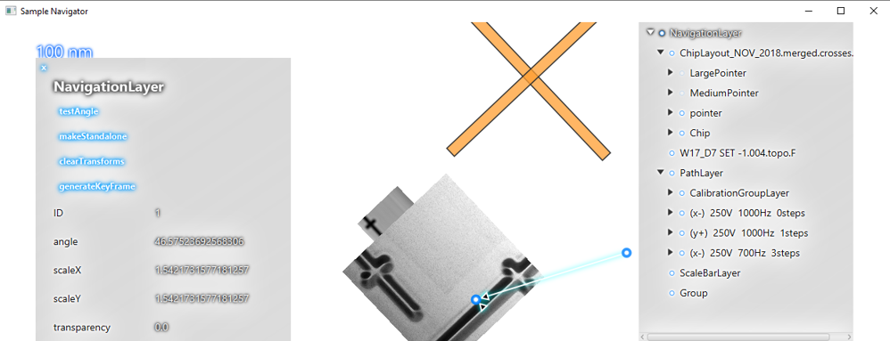

The *Group* can be re-named by selecting it in the **Tree View** and editing the *name* attribute in the **Attribute Editor**.

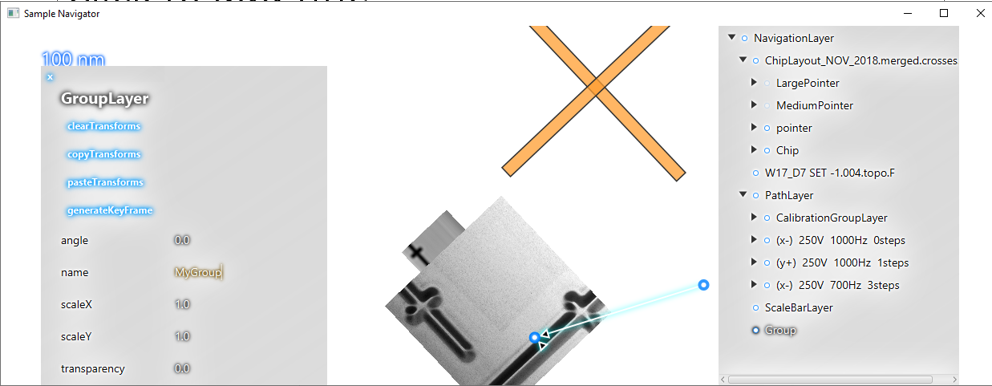

For the edit to take place, make sure to press **Enter**.

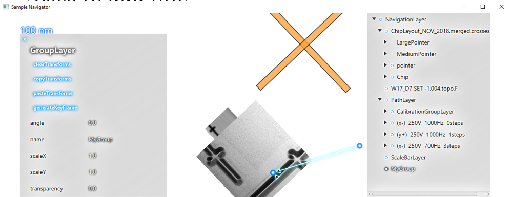

## 14. Save your edits
Press: **Ctrl** + **s**
